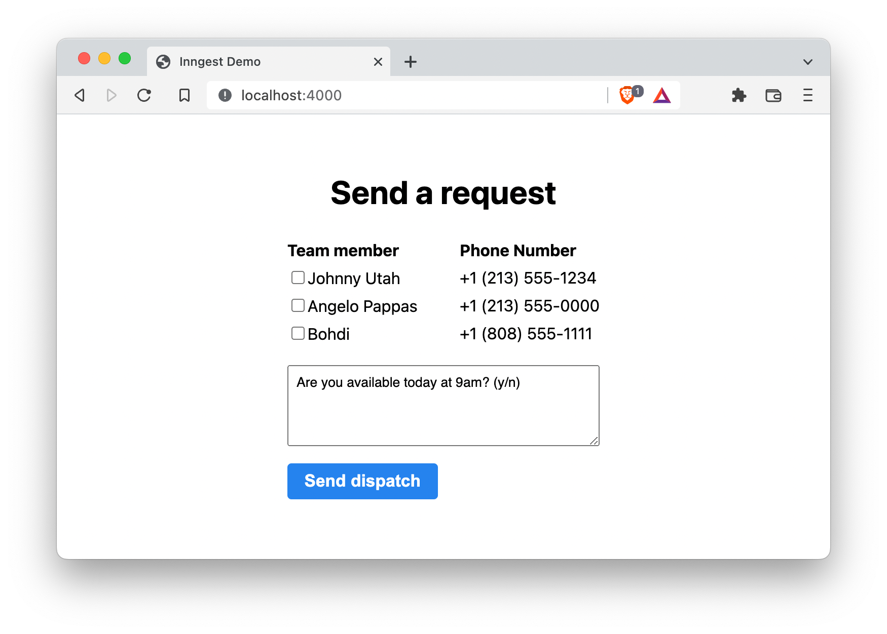

# Demo Inngest + Next.js

Start the Next.js app in dev mode and the [Inngest dev server](https://github.com/inngest/inngest-cli):

```
yarn dev
```

```
inngest dev -p 9000
```

## Environment variables

Check out `.env.example` an `.env.local.example` for direction for your own `.env` files. See [the Next.js docs](https://nextjs.org/docs/basic-features/environment-variables) for more information.

## The app

The demo app is a basic Next.js form view which when submitted, sends event(s) in batch to Inngest and runs the "Send SMS Dispatch" function.



### Notes

- Inngest dev server support for `.env` files is in development. If you want to use environment variables use `export VAR=val` before you run `inngest dev` or `run`
